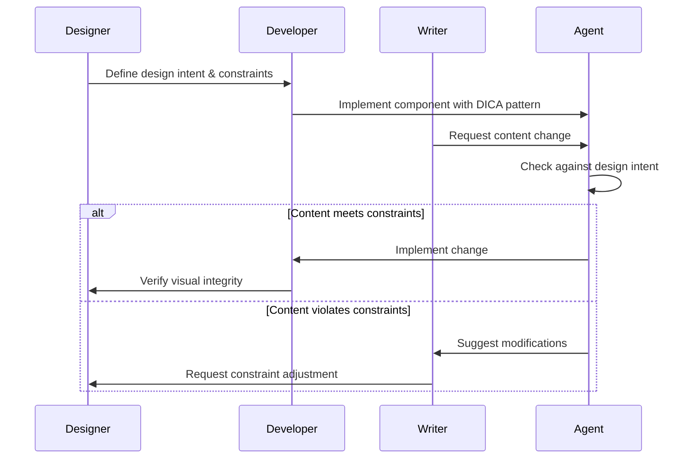
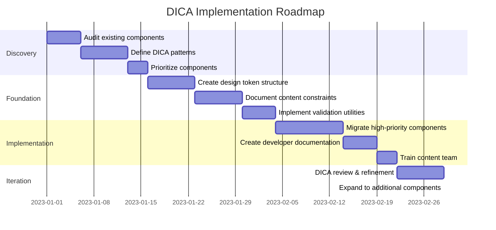

# Design-Intent Content Architecture (DICA)

## Overview

Design-Intent Content Architecture (DICA) is a methodology for managing content in modern web applications that acknowledges the reality of content as a design element. It challenges traditional content-code separation paradigms by recognizing that in creative, design-focused websites, content and presentation are often deeply intertwined.

## Core Principles

### 1. Content Purpose Classification

Content is not monolithic and should be treated differently based on its purpose:

- **Design-Critical Content**: Text that functions as a design element (headers, featured quotes, animation elements)
  - Inherently tied to visual presentation
  - Often requires specific styling, positioning, or animation
  - Changes impact visual design integrity

- **Narrative Content**: Standard body text that conveys information
  - More adaptable to style changes
  - Primary purpose is communication
  - Can be modified with less visual impact

- **Functional Content**: Labels, buttons, navigation (high-reuse, low-design impact)
  - Highly reusable across the application
  - Primarily utilitarian in purpose
  - Often subject to consistency requirements

### 2. Component-Content Relationship Models

The relationship between content and components follows different patterns:

- **Component-Owned**: Design-critical content lives with its component
  - Content and component are inseparable for design integrity
  - Examples: Animated headers, feature highlights, branded elements
  - Change process involves design consideration

- **Content-Injected**: Content is passed in but maintains styling requirements
  - Content can vary but must adhere to design constraints
  - Examples: Cards, testimonials, feature descriptions
  - Component enforces styling regardless of content

- **Data-Driven**: Pure information displayed through consistent patterns
  - Content is purely informational
  - Examples: Product listings, team grids, pricing tables
  - Styling is completely independent of specific content

### 3. Agent-Centric Documentation

Documentation is structured to facilitate AI agent understanding:

- **Design Intent**: Explain the "why" behind content-design relationships
- **Visual References**: Include examples of correct implementation
- **Constraints**: Document limitations that preserve design integrity
- **Edit Guidance**: Provide specific instructions for content modifications

## Implementation Structure

### Directory Organization

```
src/
├── components/
│   ├── DesignCriticalComponents/
│   │   ├── AnimatedHeader/
│   │   │   ├── index.tsx             # Component with owned content
│   │   │   ├── implementation.tsx    # Core implementation logic
│   │   │   └── design-intent.md      # Visual reference & editing guidelines
│   │   └── ...
│   ├── ContentInjectedComponents/
│   │   ├── FeatureCard/
│   │   │   ├── index.tsx             # Component that receives content
│   │   │   └── content-specs.md      # Content requirements & constraints
│   │   └── ...
│   └── DataDrivenComponents/
│       ├── TeamGrid/
│       │   ├── index.tsx             # Pure data display component
│       │   └── data-schema.ts        # Expected data structure
│       └── ...
├── content/
│   ├── narrative/                    # Longer-form, less design-critical content
│   └── functional/                   # Reusable UI text elements
└── design-system/
    └── content-treatments.ts         # Reusable content styling patterns
```

### Component Implementation Patterns

#### Component-Owned Pattern

```tsx
export const AnimatedHeader = () => {
  // Content is component-owned because it's design-critical
  const HEADER_CONTENT = {
    prefix: "MEET THE",
    animatedWords: ["FOUNDER", "DEVELOPER", "DESIGNER"],
    // Design intent documentation for agents
    __designIntent: {
      purpose: "Create visual tension between static/animated text",
      visualBalance: "Words should have similar visual weight",
      constraints: "Words must fit within 200px at the specified font size",
      editingGuidance: "Adding longer words may require adjusting container width"
    }
  };

  return <AnimatedHeaderImplementation content={HEADER_CONTENT} />;
};
```

#### Content-Injected Pattern

```tsx
export const FeatureCard = ({ feature }) => {
  // Content is injected but has styling requirements
  return (
    <div className="card">
      <h3 className="title">{feature.title}</h3>
      <p className="description">{feature.description}</p>
      {/* Content styling guidance for agents */}
      {process.env.NODE_ENV === 'development' && feature.title.length > 20 && (
        <div className="agent-warning">
          Title length may cause layout issues
        </div>
      )}
    </div>
  );
};
```

#### Data-Driven Pattern

```tsx
export const TeamGrid = ({ teamMembers }) => {
  // Pure data display with consistent styling
  return (
    <div className="grid">
      {teamMembers.map(member => (
        <TeamMemberCard key={member.id} member={member} />
      ))}
    </div>
  );
};
```

## Design Intent Documentation

Each design-critical component should include a design intent document:

```markdown
# AnimatedHeader Design Intent

## Purpose
The animated header creates visual emphasis through the contrast between the static "MEET THE" text and the animated role words.

## Visual Reference
[Include screenshot or link to design]

## Content Constraints
- Animated words should be 4-10 characters
- All words should be uppercase
- Maximum of 8 different words in the rotation

## Edit Guidance
- When adding new words, ensure they maintain similar length to existing words
- If longer words are needed, container width may need adjustment
- Font weight should remain consistent

## Animation Settings
- Type speed: 150ms per character
- Delete speed: 80ms per character
- Pause duration: 2000ms when word is complete
```

## Agent Workflow

1. **Understand Request**: Agent receives content update request
2. **Classify Content**: Determine content type (design-critical, narrative, functional)
3. **Consult Documentation**: Review relevant design intent documentation
4. **Apply Changes**: Make changes according to documented constraints
5. **Verify Impact**: Check that changes preserve design integrity
6. **Document Actions**: Note any design considerations addressed

## Team and Agent Collaboration Framework

The successful implementation of DICA depends on effective collaboration between human team members (designers, developers, content writers) and AI agents. This framework establishes clear communication patterns and responsibilities.

### 1. Role Definitions and Responsibilities

| Role | Primary Responsibilities | DICA-Specific Tasks |
|------|-------------------------|---------------------|
| **Designer** | Visual design, user experience | Define design intent documentation, set content constraints, review visual integrity |
| **Developer** | Technical implementation | Implement DICA patterns, create validation systems, integrate content with styling |
| **Content Writer** | Content creation, messaging | Create content within design constraints, review content-design balance |
| **AI Agent** | Assistance and automation | Apply changes within documented constraints, flag potential design impacts, maintain documentation |
| **Product Manager** | Feature prioritization, coordination | Balance content flexibility with design integrity, mediate design-content decisions |

### 2. Collaboration Touchpoints



### 3. Communication Patterns

#### Design Intent Communication

When designers establish the design intent for content:

```
// Example design intent communication
{
  component: "HeroSection",
  designIntent: {
    purpose: "Create immediate visual impact with concise headline",
    visualRequirements: [
      "Headline must be legible at all viewport sizes",
      "Text should create strong contrast with background image",
      "Animation timing creates natural reading rhythm"
    ],
    contentConstraints: {
      headline: "5-7 words, preferably with one word emphasized",
      subheadline: "Max 100 characters, support headline without repeating"
    }
  },
  visualReference: "figma.com/file/abc123/hero-section"
}
```

#### Agent-to-Human Escalation Protocol

When an agent needs human input on a content decision:

1. **Identify Issue Type:**
   - Design constraint violation
   - Ambiguous design intent
   - Multiple valid interpretations
   - Technical limitation

2. **Structured Escalation Format:**
   ```
   {
     escalationType: "DESIGN_CONSTRAINT_VIOLATION",
     component: "FeatureCard",
     requestedChange: "Add longer feature title that exceeds character limit",
     constraintViolated: "Title max length (30 chars)",
     impact: "May cause title to wrap to 3 lines, disrupting card height consistency",
     suggestedAlternatives: [
       "Shorter title version that fits constraints",
       "Adjustment to title max length constraint",
       "UI adaptation to accommodate longer titles"
     ],
     decisionNeeded: "Should we enforce current constraint or adjust design?"
   }
   ```

3. **Appropriate Routing:**
   - Design questions → Designer
   - Technical limitations → Developer
   - Content strategy → Content Writer
   - Priority decisions → Product Manager

### 4. Handoff Documentation

For effective collaboration, standardize handoff documentation between roles:

#### Designer to Developer Handoff

```markdown
# Component: Testimonial Card

## Design Intent
- Create social proof through highlighted customer quotes
- Visual emphasis on the quote itself, with secondary emphasis on customer details
- Cards should maintain consistent height regardless of content length

## Content Constraints
- Quote: 100-250 characters
- Customer Name: Full name required
- Customer Title: Position and company (optional)
- Customer Image: Square ratio, will be rendered as circle

## Content-Design Relationship
- Long quotes will truncate with ellipsis after 3 lines
- Customer details maintain fixed height
- Image size remains consistent

## Visual Reference
[Link to design file with multiple examples]
```

#### Developer to Agent Handoff

```typescript
// TestimonialCard.tsx

// @DICA ComponentType: Content-Injected
// @DesignIntent: Create social proof with consistent card styling
// @ContentConstraints: See design-intent.md for full documentation

interface TestimonialProps {
  quote: string;      // @constraint: 100-250 chars
  name: string;       // @constraint: Full name required
  title?: string;     // @constraint: Position and company (optional)
  image: string;      // @constraint: Square ratio image
}

// Component implementation...
```

#### Agent to Writer Handoff

```markdown
# Content Request: Update Testimonial Section

## Requested Changes
- Add new testimonial from Company X
- Update John Smith's title from "Developer" to "Lead Engineer"

## Design Constraints Applied
- Truncated quote to 250 characters (was 275)
- Maintained name format consistency
- Title follows "[Position] at [Company]" pattern

## Design Impact Assessment
- All changes maintain visual consistency
- Card heights remain uniform
- No layout shifts introduced
```

### 5. Collaborative Decision-Making Framework

When content and design requirements conflict, use this decision-making process:

1. **Issue Identification:**
   - Clearly define what content request conflicts with which design constraint

2. **Impact Assessment:**
   - Document visual/UX impact of accommodating the content request
   - Document communication impact of enforcing the design constraint

3. **Solution Exploration:**
   - Compromise solutions that partially preserve both needs
   - Alternative approaches to presenting the content
   - Minor design adjustments that maintain core visual integrity

4. **Decision Documentation:**
   ```
   {
     issue: "Testimonial quote length exceeds design constraint",
     decision: "Increase max length to 300 chars, but maintain 3-line truncation",
     rationale: "Preserves important customer context while maintaining card height consistency",
     approval: ["Design Lead", "Content Manager"],
     precedent: "This adjustment applies to all testimonial cards going forward"
   }
   ```

### 6. Continuous Improvement Cycle

Establish a regular process for refining the DICA implementation:

1. **Collect Implementation Feedback:**
   - Developer pain points
   - Content update challenges
   - Design compromise frequency

2. **Review Design Intent Clarity:**
   - Identify most frequently violated constraints
   - Evaluate clarity of design intent documentation
   - Assess visual reference comprehensiveness

3. **Refine Constraints and Patterns:**
   - Update constraints to match realistic content needs
   - Evolve patterns based on implementation experience
   - Enhance documentation with learned examples

4. **Share Learning:**
   - Document case studies of successful resolutions
   - Create pattern library of excellent implementations
   - Update agent training with new examples

By establishing this collaboration framework, teams can effectively balance the creative needs of design with the practical requirements of content management, creating a system that maintains visual integrity while enabling efficient content updates.

## Agile Development Integration

Implementing DICA methodology within agile development workflows requires thoughtful integration with existing processes. This section outlines practical approaches for introducing and maintaining DICA within agile teams.

### 1. Sprint Planning and DICA Implementation

DICA implementation can be integrated into agile planning through a phased approach:



#### Sprint-by-Sprint Implementation Plan

| Sprint | Focus | Activities | Deliverables |
|--------|-------|------------|--------------|
| 1 | Discovery | Audit, define patterns, prioritize | Component audit report, DICA pattern definitions, prioritized implementation list |
| 2 | Foundation | Create token structure, document constraints | Design token system with content constraints, documentation |
| 3 | Validation | Build validation tools, test framework | Validation utilities, initial test suite |
| 4-5 | Implementation | Migrate high-priority components | Updated components with DICA patterns |
| 6 | Documentation | Developer docs, training materials | Documentation, training session |
| 7+ | Expansion | Regular reviews, expand coverage | Continuous improvement |

#### Story Point Estimation Guidelines

When estimating DICA-related stories, consider these factors:

1. **Component Complexity:**
   - Simple (static content, minimal variants): 2-3 points
   - Moderate (dynamic content, multiple variants): 5-8 points
   - Complex (animation, responsive content variants): 8-13 points

2. **Migration Effort:**
   - No structural changes needed: 1-2 points
   - Minor refactoring required: 3-5 points
   - Significant refactoring: 8-13 points

3. **Documentation Requirements:**
   - Update existing docs: 1 point
   - Create new pattern docs: 2-3 points
   - Comprehensive design intent docs: 3-5 points

### 2. User Story Templates for DICA Implementation

Structure DICA-related user stories to capture implementation details:

```
Title: Implement DICA Component-Owned Pattern for Hero Section

As a developer, 
I want to refactor the Hero Section to use the DICA Component-Owned pattern,
So that design intent is preserved when content is updated.

Acceptance Criteria:
- Content is structured according to Component-Owned pattern
- Design intent metadata is documented with visual constraints
- Content validation is implemented in development environment
- Unit tests verify content meets design constraints
- Design team has reviewed and approved implementation

Design Artifacts:
- [Link to design specifications]
- [Link to content constraints document]

Technical Notes:
- Existing Hero component is in src/components/HeroSection.tsx
- Should extract content to local constant with __designIntent metadata
- Add runtime validation in development environment
```

### 3. Definition of Done for DICA Components

Extend standard Definition of Done to include DICA-specific requirements:

```markdown
# Definition of Done: DICA Components

In addition to standard Definition of Done criteria, DICA components must:

## Content Structure
- [ ] Uses appropriate DICA pattern (Component-Owned/Content-Injected/Data-Driven)
- [ ] Content structure follows established naming conventions
- [ ] Design intent metadata is complete and accurate

## Documentation
- [ ] Design intent documentation includes all required sections
- [ ] Visual references are included or linked
- [ ] Content constraints are explicitly documented

## Validation
- [ ] Runtime validation implemented for development environment
- [ ] Unit tests verify content constraints
- [ ] Responsive behavior tested on all target breakpoints

## Review
- [ ] Design team has reviewed implementation
- [ ] Content team has been informed of constraints
- [ ] Code reviewer has verified DICA compliance
```

### 4. DICA Ceremonies and Rituals

Integrate DICA-specific activities into existing agile ceremonies:

#### Sprint Planning

- Review upcoming components for DICA pattern assignment
- Identify potential content-design integration challenges
- Assign appropriate story points based on DICA complexity

#### Design-Dev Handoff

- Include explicit design intent documentation
- Review content constraints with both design and development teams
- Document expected content variation scenarios

#### Sprint Review

- Demonstrate DICA components with various content scenarios
- Verify design intent is preserved across content variations
- Collect feedback on content constraints from stakeholders

#### Retrospective

- Evaluate effectiveness of DICA implementation
- Identify opportunities to improve DICA processes
- Document lessons learned for future sprints

### 5. Incremental Implementation Strategy

For large existing codebases, implement DICA incrementally:

#### 1. Component Categorization

```markdown
# DICA Implementation Tiers

## Tier 1: High-Priority Components (Sprint 3-4)
- Hero sections
- Feature cards
- Call-to-action sections
- Testimonial blocks

## Tier 2: Medium-Priority Components (Sprint 5-7)
- Navigation menus
- Footer sections
- Product listings
- Service descriptions

## Tier 3: Low-Priority Components (Sprint 8+)
- Utility components
- Form elements
- Modal dialogs
- Notification elements
```

#### 2. Progressive Enhancement

Implement DICA in layers to avoid disrupting ongoing development:

1. **Layer 1:** Add design intent documentation to existing components
2. **Layer 2:** Restructure content according to appropriate DICA pattern
3. **Layer 3:** Implement runtime validation and testing
4. **Layer 4:** Refactor for token integration and constraint automation

#### 3. Feature Flags

Use feature flags to safely introduce DICA patterns:

```tsx
// Progressive implementation with feature flags
const useDesignIntent = true; // Feature flag for DICA implementation

const HeroSection = () => {
  if (useDesignIntent) {
    // DICA implementation
    const HERO_CONTENT = {
      title: "Transform Your Digital Experience",
      subtitle: "Award-winning design studio helping brands stand out",
      
      __designIntent: {
        version: "1.0",
        purpose: "Create immediate visual impact with bold heading",
        constraints: {
          title: "Max 50 characters, no line breaks",
          subtitle: "Max 100 characters, supporting headline"
        }
      }
    };
    
    return (
      <section className="hero">
        <h1>{HERO_CONTENT.title}</h1>
        <p>{HERO_CONTENT.subtitle}</p>
        {/* Rest of implementation */}
      </section>
    );
  } else {
    // Legacy implementation
    return (
      <section className="hero">
        <h1>Transform Your Digital Experience</h1>
        <p>Award-winning design studio helping brands stand out</p>
        {/* Rest of implementation */}
      </section>
    );
  }
};
```

### 6. Acceptance Criteria Templates

Create standardized acceptance criteria for different DICA patterns:

#### Component-Owned Pattern

```markdown
## Acceptance Criteria: Component-Owned Pattern

1. Content Structure:
   - [ ] Content is defined within component file
   - [ ] Design intent metadata documents purpose and constraints
   - [ ] Visual elements and content are structured as a cohesive unit

2. Validation:
   - [ ] Content meets documented constraints
   - [ ] Runtime validation warns about constraint violations in development
   - [ ] Tests verify design intent is preserved

3. Documentation:
   - [ ] Design purpose is clearly explained
   - [ ] Content constraints are explicitly defined
   - [ ] Visual references demonstrate correct implementation
```

#### Content-Injected Pattern

```markdown
## Acceptance Criteria: Content-Injected Pattern

1. Content Structure:
   - [ ] Component accepts content via props
   - [ ] Prop types enforce basic content constraints
   - [ ] Default/fallback content preserves design intent

2. Validation:
   - [ ] Content validation functions check incoming content
   - [ ] Warning system alerts developers to constraint violations
   - [ ] Tests verify styling applies consistently across content variants

3. Documentation:
   - [ ] Content constraints are documented in component and props
   - [ ] Examples demonstrate valid and invalid content scenarios
   - [ ] Integration guide explains content requirements
```

#### Data-Driven Pattern

```markdown
## Acceptance Criteria: Data-Driven Pattern

1. Content Structure:
   - [ ] Data schema enforces required fields and types
   - [ ] Component renders consistently with variable data
   - [ ] Empty/partial data states are handled gracefully

2. Validation:
   - [ ] Data validation functions verify content meets design requirements
   - [ ] Tests confirm layout stability with different data sets
   - [ ] Edge cases (very long/short content) are properly handled

3. Documentation:
   - [ ] Data schema is fully documented
   - [ ] Examples show rendering with various data scenarios
   - [ ] Visual guidelines demonstrate layout expectations
```

### 7. Agile Metrics for DICA Success

Track these metrics to evaluate DICA implementation success:

1. **Design Consistency Index:**
   - Measure consistency in visual presentation across content variations
   - Track design system adherence before and after DICA implementation

2. **Content Update Efficiency:**
   - Time required to update content (before vs. after DICA)
   - Reduction in design review cycles for content changes

3. **Developer Experience:**
   - Time spent addressing content-related design issues
   - Reduction in design debt related to content changes

4. **Quality Metrics:**
   - Regression bugs after content updates (should decrease)
   - Design intent violations identified by validation tools

5. **Adoption Rate:**
   - Percentage of eligible components using DICA patterns
   - Team compliance with DICA documentation requirements

### 8. Scaled Agile Considerations

For teams using scaled agile frameworks:

#### PI Planning Integration

1. **DICA Readiness Assessment:**
   - Evaluate components for DICA implementation
   - Identify dependencies between teams

2. **Cross-Team Coordination:**
   - Align on DICA patterns across feature teams
   - Establish shared documentation standards

3. **Design System Integration:**
   - Coordinate DICA implementation with design system roadmap
   - Plan content constraint evolution with design token changes

#### Program-Level Definition of Done

Extend program-level Definition of Done for features involving DICA:

```markdown
# Program-Level DICA Requirements

For features to be considered "Done" at the program level:

1. All new/modified components follow appropriate DICA patterns
2. Design intent documentation is complete for all components
3. Cross-team dependencies on DICA patterns are resolved
4. Design system integration is verified and consistent
5. Content teams have been trained on new constraints
6. Performance impact of DICA implementation has been measured
```

By integrating DICA methodology into agile workflows, teams can systematically implement and maintain design-intent content architecture while continuing to deliver value through their regular sprint cadence.

## Benefits Over Traditional Approaches

1. **Design Integrity**: Preserves the relationship between content and design
2. **Reduced Complexity**: Eliminates artificial separation where it doesn't provide value
3. **Agent Optimization**: Provides clear guidance for AI editing
4. **Evolution-Ready**: Creates a flexible framework that can adapt to changing needs
5. **Reality-Based**: Acknowledges the actual workflows of creative web development

## When to Use DICA

DICA is ideally suited for:
- Creative agency websites
- Brand-focused web applications
- Sites with complex visual storytelling
- Projects where design and content evolve together
- Teams working with AI agents for content updates

Traditional content separation may still be preferable for:
- Large multi-language corporate sites
- Content-heavy applications like documentation
- Projects with dedicated content teams
- Websites requiring frequent non-technical content updates

## Conclusion

Design-Intent Content Architecture provides a pragmatic solution to the challenges of managing content in design-focused websites. By acknowledging the reality that some content is intrinsically tied to design elements, DICA offers a more effective approach to content management in the agentic era of web development. 